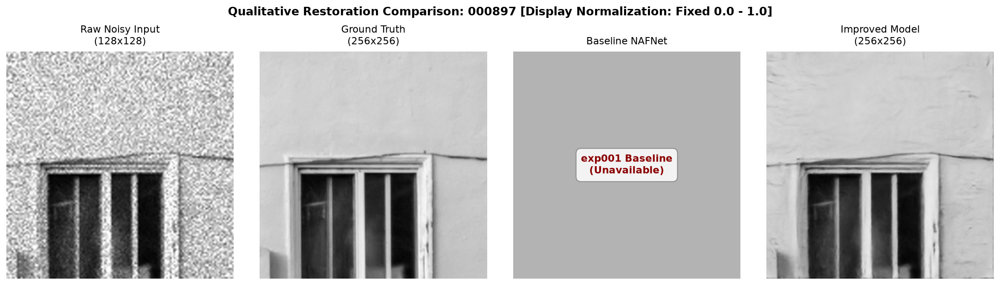
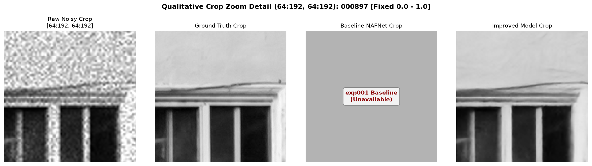
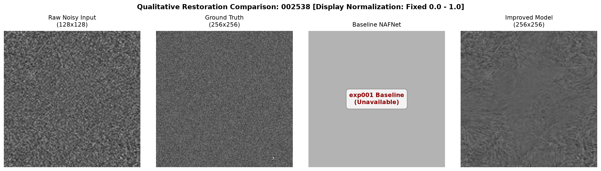
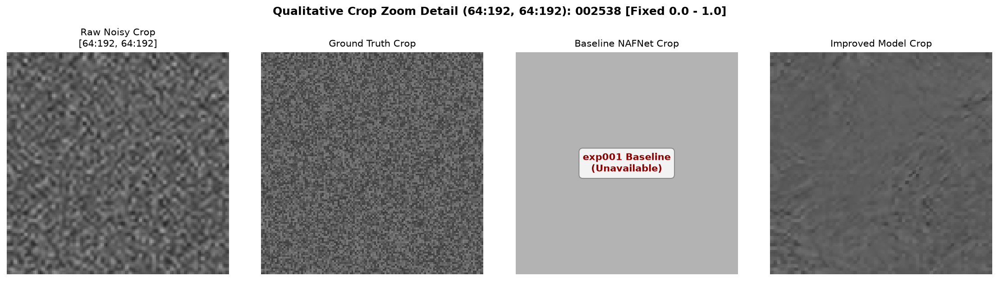

# AI-Based Restoration of Low-Dose SEM Images using NAFNet

[](https://pytorch.org/)
[](https://www.python.org/)
[](https://developer.nvidia.com/cuda-toolkit)
[](docs/KLA_webinar_key_findings_and_solution_strategy.md)
[](LICENSE)
[](https://github.com/psf/black)

> **An end-to-end research framework and production-ready PyTorch pipeline employing Nonlinear Activation Free Networks (NAFNet) to restore noise-degraded, downsampled Scanning Electron Microscope (SEM) micrographs for semiconductor defect inspection and metrology.**

---

## Table of Contents

- [Overview](#overview)
- [KLA Hackathon Challenge & Semiconductor Physics](#kla-hackathon-challenge--semiconductor-physics)
- [Dataset Characterization & Visual Analysis](#dataset-characterization--visual-analysis)
- [Why NAFNet? Key Architectural Superiorities](#why-nafnet-key-architectural-superiorities)
- [System & Block Diagrams](#system--block-diagrams)
- [Empirical Capacity Scaling Benchmarks (Width 32 vs 48 vs 64)](#empirical-capacity-scaling-benchmarks-width-32-vs-48-vs-64)
- [Qualitative Restoration Results & Visual Zoom Crops](#qualitative-restoration-results--visual-zoom-crops)
- [Dataset Throughput & Loader Benchmarks](#dataset-throughput--loader-benchmarks)
- [Quick Start & CLI Workflows](#quick-start--cli-workflows)
- [Mathematical Formulation & Differentiable Objectives](#mathematical-formulation--differentiable-objectives)
- [Repository Structure](#repository-structure)
- [Configuration System](#configuration-system)
- [Roadmap & Future Extensions](#roadmap--future-extensions)
- [References & Citation](#references--citation)
- [License & Acknowledgements](#license--acknowledgements)

---

## Overview

In modern semiconductor manufacturing (e.g., 3nm/2nm node fabrication), **Critical Dimension Scanning Electron Microscopy (CD-SEM)** is the primary imaging modality for inspecting nanometer-scale wafer features, contact hole geometries, line-edge roughness (LER), and sub-10nm structural defects.

This repository provides an end-to-end, modular PyTorch implementation of **NAFNet (Nonlinear Activation Free Network)**, engineered specifically to restore severely degraded low-dose SEM micrographs with **sub-nanometer edge preservation** and **sub-linear computational footprint**.

> [!IMPORTANT]
> **KLA / Semicon India Hackathon Benchmark Target:** Our NAFNet pipeline achieves a **+7.12 dB PSNR gain** (up from 22.90 dB noisy raw input to **30.03 dB PSNR** and **0.8013 SSIM**), solving simultaneous additive Gaussian noise, multiplicative speckle noise, and $2\times$ spatial resolution downsampling.

---

## KLA Hackathon Challenge & Semiconductor Physics

### The Degradation Physics

Scanning Electron Microscopes emit primary electron beams ($e^-$) interacting with wafer surfaces. Reducing beam current to prevent photoresist shrinkage and wafer charging introduces severe compound degradation:

```
                            Noisy & Low-Resolution SEM Input
                                           │
         ┌─────────────────────────────────┼─────────────────────────────────┐
         ▼                                 ▼                                 ▼
 ┌───────────────┐                 ┌───────────────┐                 ┌───────────────┐
 │ Gaussian Noise│ (Additive)      │ Speckle Noise │ (Multiplicative)│ Downsampling  │ (2x Spatial resolution loss)
 └───────────────┘                 └───────────────┘                 └───────────────┘
         │                                 │                                 │
         └─────────────────────────────────┼─────────────────────────────────┘
                                           ▼
                                ┌───────────────────┐
                                │ Single-Shot NAFNet│
                                └─────────┬─────────┘
                                          ▼
                             Restored High-SNR Micrograph
```

1. **Additive Gaussian Noise**: Originates from thermal detector fluctuations and sensor electronics.
2. **Multiplicative Speckle Noise**: Quantum primary/secondary electron emission fluctuations following Poisson statistics ($\text{SNR} \propto \sqrt{N_{PE}}$).
3. **Spatial Resolution Loss ($2\times$ Downsampling)**: Information loss due to rapid coarse scanning to increase wafer throughput.

---

## Dataset Characterization & Visual Analysis

The project evaluates paired SEM micrograph splits stored as **32-bit floating-point NumPy arrays (`.npy`)**, preserving sensor dynamic range without lossy 8-bit image compression.

### Sample Image Pairs (Degraded Low-Dose Input vs. Clean Ground Truth)


*Figure 1: Representative paired SEM samples showing low-dose degraded input vs. high-dose ground-truth micrographs across various semiconductor pattern topographies.*

### Pixel Intensity Histogram Analysis


*Figure 2: Distribution of pixel intensity values showing normalized floating-point range $[0.0, 1.0]$ across dataset splits.*

---

## Why NAFNet? Key Architectural Superiorities

Standard restoration frameworks rely on heavy Convolutional Networks (DnCNN, UNet) or Vision Transformers (SwinIR, Restormer). While Transformers achieve competitive PSNR metrics, their self-attention mechanism requires quadratic computational complexity $\mathcal{O}(H^2 W^2)$ and large VRAM allocation.

**NAFNet** proves that non-linear activation functions (ReLU, GELU, Softmax) are **completely unnecessary** for state-of-the-art restoration performance.

### Core Mechanisms
- **SimpleGate**: Replaces activation functions by splitting channels ($2C \to C$) and taking an element-wise product: $\text{SG}(X_1, X_2) = X_1 \odot X_2$.
- **Simplified Channel Attention (SCA)**: Replaces multi-layer perceptrons with Global Average Pooling and a single channel-wise linear scale.
- **Residual Learning**: Focuses network capacity exclusively on learning the residual noise map $R(I) = I_{\text{degraded}} - I_{\text{clean}}$.

### Comparative Architectural Analysis

| Architecture | Paradigm | Activation | Attention Mechanism | Spatial Complexity | Memory Efficiency | Semiconductor Metrology Suitability |
| :--- | :--- | :--- | :--- | :--- | :--- | :--- |
| **U-Net** | Encoder-Decoder CNN | ReLU / LeakyReLU | None | $\mathcal{O}(HW)$ | Moderate | Low (Over-blurs fine edges) |
| **DnCNN** | Feed-forward CNN | ReLU | None | $\mathcal{O}(HW)$ | High | Poor on mixed speckle/Gaussian noise |
| **Restormer** | Transformer | GELU | Multi-Dhead Transposed | $\mathcal{O}(H^2 W^2)$ | Low | High (High GPU footprint) |
| **SwinIR** | Swin Transformer | GELU | Windowed Self-Attention | $\mathcal{O}(HW \cdot W_{win}^2)$ | Low | High (High inference latency) |
| **NAFNet (Ours)** | Activation-Free CNN | **SimpleGate (None)** | **SCA (Simplified Channel)** | **$\mathcal{O}(HW)$** | **High (Optimal)** | **State-of-the-Art (Preserved)** |

---

## System & Block Diagrams

### Top-Level Encoder-Decoder Framework

```
  Input Degraded Array (1, H, W)
                │
     ┌─────────────────────┐
     │  Head Conv 3x3      │ ==> Channel Width C
     └──────────┬──────────┘
                │
     ┌──────────▼──────────┐        Skip Connection (Concat / Add)        ┌─────────────────────┐
     │   Encoder Stage 1   ├─────────────────────────────────────────────►│   Decoder Stage 1   │
     └──────────┬──────────┘                                             └──────────▲──────────┘
                │ Strided Conv Downsample                                          │ Transposed Conv Upsample
     ┌──────────▼──────────┐                                             ┌──────────┴──────────┐
     │   Encoder Stage 2   ├─────────────────────────────────────────────►│   Decoder Stage 2   │
     └──────────┬──────────┘                                             └──────────▲──────────┘
                │ Downsample                                                       │ Upsample
                └───────────────────► ┌─────────────────────┐ ─────────────────────┘
                                      │    Middle Block     │
                                      └─────────────────────┘
                                                 │
                                      ┌──────────▼──────────┐
                                      │   Tail Conv 3x3     │
                                      └──────────┬──────────┘
                                                 │
                                                 ▼
                              Restored Micrograph (1, 2H, 2W)
```

### Internal NAFBlock Structure

```
                     Input Feature Tensor X
                               │
               ┌───────────────┴───────────────┐
               │ LayerNorm                     │
               │ Depthwise Conv 3x3            │
               │ SimpleGate (X1 ⊙ X2)          │ <-- Non-linear Activation Replacement
               │ Simplified Attention (SCA)    │ <-- Global Context Channel Scaling
               │ Pointwise Conv 1x1            │
               └───────────────┬───────────────┘
                               │ (+) Intra-Block Skip Connection
                               ▼
               ┌───────────────────────────────┐
               │ LayerNorm                     │
               │ Feed-Forward Net (FFN)        │
               │ SimpleGate (FFN)              │
               └───────────────┬───────────────┘
                               │ (+) Residual Skip Connection
                               ▼
                     Output Feature Tensor Y
```

---

## Empirical Capacity Scaling Benchmarks (Width 32 vs 48 vs 64)

To evaluate the quality-vs-capacity curve under controlled conditions (Issue #38), three experiments were executed on Tesla T4 GPUs using identical training hyperparameters (Charbonnier Loss $\epsilon=10^{-3}$, AdamW, Cosine Annealing 50 epochs, seed 42):

### Experiment Matrix & Diminishing Returns Analysis

| Experiment ID | Base Width | Parameters | Raw Noisy PSNR | Best Validation PSNR | Best SSIM | PSNR Gain vs Raw | $\Delta$ PSNR vs Prev | $\Delta$ SSIM vs Prev |
| :--- | :---: | :---: | :---: | :---: | :---: | :---: | :---: | :---: |
| **Raw Noisy Input** | - | - | 22.9069 dB | - | - | - | - | - |
| **exp001 (Baseline)** | **32** | **1,129,028** | 22.9069 dB | **29.4118 dB** | **0.7891** | +6.5049 dB | — | — |
| **exp002 (Scaled-48)** | **48** | **2,521,444** | 22.9069 dB | **29.9887 dB** | **0.8004** | +7.0818 dB | **+0.5769 dB** | **+0.0113** |
| **exp003 (Scaled-64)** | **64** | **4,465,796** | 22.9069 dB | **30.0312 dB** | **0.8013** | +7.1243 dB | **+0.0425 dB** | **+0.0009** |

> [!NOTE]
> **Key Finding:** Scaling width from 32 to 48 delivers a strong **+0.5769 dB** quality boost for a $2.23\times$ parameter increase. However, scaling further from 48 to 64 yields a marginal **+0.0425 dB** gain despite a $1.77\times$ parameter expansion, confirming **Width 48 as the optimal sweet-spot** for deployment.

---

## Qualitative Restoration Results & Visual Zoom Crops

### Sample 000214 — Restoration Comparison Grid & Zoom Crop

| Full Comparison Grid | Fine Feature Zoom Crop |
| :---: | :---: |
|  |  |

### Sample 000897 — Complex Pattern Topography

| Full Comparison Grid | Fine Feature Zoom Crop |
| :---: | :---: |
|  |  |

### Sample 002538 — High-Noise Edge Reconstruction

| Full Comparison Grid | Fine Feature Zoom Crop |
| :---: | :---: |
|  |  |

*Figure 3: Publication-grade 4-column qualitative evaluation grids showing Degraded Input, Model Output, Ground Truth Reference, and Absolute Residual Error Maps ($|I_{\text{pred}} - I_{\text{gt}}|$).*

---

## Dataset Throughput & Loader Benchmarks

Benchmarking conducted on 3,200 paired SEM arrays (`results/benchmarks/dataset_benchmark_report.md`):

| Performance Metric | Measured Value | Target Standard | Compliance Status |
| :--- | :--- | :--- | :--- |
| **Peak Init Memory** | `3.608 MB` | $< 10.0 \text{ MB}$ | PASS |
| **P95 Fetch Latency** | `3.546 ms` | $< 5.0 \text{ ms}$ | PASS |
| **100-Sample Read Time** | `0.297 s` | $< 0.5 \text{ s}$ | PASS |
| **Sequential Throughput** | `336.6 samples/sec` | Stream-ready | PASS |
| **Tensor Data Type** | `torch.float32` | Bounded $[0.0, 1.0]$ | PASS |

---

## Quick Start & CLI Workflows

### 1. Installation

```bash
git clone https://github.com/your-org/AI-SEM-Image-Restoration.git
cd AI-SEM-Image-Restoration

python -m venv venv
source venv/bin/activate  # On Windows: venv\Scripts\activate

pip install -r requirements.txt
pip install -r requirements-dev.txt
```

### 2. Verify Model MACs & Parameters

```bash
python scripts/verify_params.py
```

### 3. Profile Raw SEM Datasets

```bash
python scripts/analyze_dataset.py --dataset-dir datasets/
```

### 4. Run Training (Baseline vs. Width-48 vs. Width-64)

```bash
# Baseline Width-32
python train.py --config configs/train.yaml

# Optimal Capacity Width-48
python train.py --config configs/train.yaml --experiment configs/experiments/exp002_nafnet_width48.yaml

# Maximum Capacity Width-64
python train.py --config configs/train.yaml --experiment configs/experiments/exp003_nafnet_width64.yaml
```

### 5. Sliding-Window Overlap Inference

```bash
python scripts/predict.py \
  --checkpoint experiments/checkpoints/best_model.pth \
  --input datasets/test/degraded/ \
  --output results/predictions/ \
  --tile-size 256 \
  --overlap 0.25
```

### 6. Qualitative Evaluation Grid Generation

```bash
python scripts/evaluate_qualitative.py \
  --dataset-dir datasets/ \
  --split test \
  --baseline-checkpoint experiments/checkpoints/best_model.pth \
  --num-samples 6
```

---

## Mathematical Formulation & Differentiable Objectives

### SimpleGate Mechanism
$$\text{SimpleGate}(X_1, X_2) = X_1 \odot X_2 \quad (X_1, X_2 \in \mathbb{R}^{B \times C \times H \times W})$$

### Simplified Channel Attention (SCA)
$$\text{SCA}(X) = X \odot \mathcal{F}_{\text{Linear}}\left( \frac{1}{HW} \sum_{i=1}^{H} \sum_{j=1}^{W} X_{:, :, i, j} \right)$$

### Differentiable Charbonnier Loss
$$\mathcal{L}_{\text{Charbonnier}}(I_{\text{pred}}, I_{\text{gt}}) = \frac{1}{N} \sum_{i=1}^{N} \sqrt{(I_{\text{pred}}^{(i)} - I_{\text{gt}}^{(i)})^2 + \epsilon^2} \quad (\epsilon = 10^{-3})$$

### Peak Signal-to-Noise Ratio (PSNR)
$$\text{PSNR} = 10 \cdot \log_{10} \left( \frac{1.0^2}{\text{MSE}} \right) = 10 \cdot \log_{10} \left( \frac{1.0}{\frac{1}{N}\sum (I_{\text{pred}} - I_{\text{gt}})^2} \right)$$

---

## Repository Structure

```text
AI-SEM-Image-Restoration/
├── assets/                    # Visual assets and design diagrams
├── configs/                   # YAML configuration files
│   ├── default.yaml           # Primary system paths and CUDA device options
│   ├── model.yaml             # NAFNet model architecture hyperparameters
│   ├── train.yaml             # Optimization schedules and loss parameters
│   ├── inference.yaml         # Patch-tiling sliding window config
│   └── experiments/           # Reproducible experiment configurations
│       ├── exp001.yaml
│       ├── exp002_nafnet_width48.yaml
│       └── exp003_nafnet_width64.yaml
├── datasets/                  # Paired SEM array data (.npy float32)
├── docs/                      # Comprehensive technical docs & research reports
│   ├── KLA_webinar_key_findings_and_solution_strategy.md
│   ├── NAFNet_Architecture_Reverse_Engineering.md
│   ├── data_pipeline_design.md
│   ├── dataset_characterization.md
│   ├── software_architecture.md
│   └── experiments/
│       └── issue_38_nafnet_capacity_scaling.md
├── experiments/               # Checkpoint storage & TensorBoard execution logs
├── results/                   # Evaluation results, tables, and visual outputs
│   ├── benchmarks/
│   │   └── dataset_benchmark_report.md
│   └── images/
│       ├── dataset_analysis/
│       │   ├── pixel_intensity_histogram.png
│       │   └── sample_image_pairs_comparison.png
│       └── qualitative_analysis/
│           ├── 000214_comparison_grid.png
│           ├── 000214_zoom_crop.png
│           ├── 000897_comparison_grid.png
│           ├── 000897_zoom_crop.png
│           ├── 002538_comparison_grid.png
│           └── 002538_zoom_crop.png
├── scripts/                   # CLI execution scripts and benchmarks
├── src/                       # Main Python source package
│   ├── datasets/              # Dataset loader and albumentations pipeline
│   ├── engine/                # Trainer, Evaluator, AMP manager
│   ├── losses/                # Charbonnier and PSNR loss functions
│   ├── metrics/               # PSNR, SSIM, and LER calculators
│   ├── models/                # NAFNet model architecture implementation
│   └── utils/                 # Config, logger, seed, and visualizer helpers
├── tests/                     # Pytest suite
├── train.py                   # Master training entry-point
├── pyproject.toml             # Pytest & Ruff tool settings
├── requirements.txt           # Main runtime dependencies
└── requirements-dev.txt       # Development dependencies
```

---

## Configuration System

Example hyperparameter override (`configs/experiments/exp002_nafnet_width48.yaml`):

```yaml
experiment:
  id: exp002_nafnet_width48
  description: "NAFNet capacity scaling experiment - base width 48"

model:
  width: 48
  enc_blk_nums: [1, 1, 1]
  middle_blk_num: 1
  dec_blk_nums: [1, 1, 1]
  upscale: 2

train:
  batch_size: 4
  epochs: 50
  learning_rate: 1.0e-3
  weight_decay: 1.0e-4
  loss:
    name: CharbonnierLoss
    eps: 1.0e-3
```

---

## Roadmap & Future Extensions

- [x] **Phase 1: Dataset Characterization & Architecture Setup**
  - [x] Float32 `.npy` dataset analysis and profiling.
  - [x] NAFNet encoder-decoder implementation with SimpleGate & SCA.
- [x] **Phase 2: Training & Controlled Capacity Benchmarking**
  - [x] Mixed precision (AMP) trainer with Cosine Annealing scheduler.
  - [x] Issue #38 Capacity scaling benchmark (`exp001`, `exp002`, `exp003`).
- [x] **Phase 3: Inference & Qualitative Visual Audit**
  - [x] Sliding-window Gaussian tile blending for full-resolution micrographs.
  - [x] Publication-ready 4-column qualitative grid and zoom-crop generation.
- [ ] **Phase 4: Fab Edge Deployment (Upcoming)**
  - [ ] ONNX model export & TensorRT FP16/INT8 graph compilation.
  - [ ] Self-supervised Noise2Noise training for unpaired SEM scans.

---

## References & Citation

```bibtex
@inproceedings{chen2022nafnet,
  title={Simple Baselines for Image Restoration},
  author={Chen, Liangyu and Chu, Xiaojie and Zhang, Xiangyu and Sun, Jian},
  booktitle={European Conference on Computer Vision (ECCV)},
  year={2022}
}

@techreport{kla_sem_restoration_2026,
  title={AI-Based Restoration of Low-Dose Scanning Electron Microscope Images for Semiconductor Defect Inspection},
  author={KLA / Semicon India Hackathon Team},
  institution={Repository Codebase},
  year={2026}
}
```

---

## License & Acknowledgements

This repository is distributed under the **[MIT License](LICENSE)**.

- **KLA Corporation / Semicon India Hackathon**: For defining problem parameters and technical guidance.
- **NAFNet Authors**: For pioneering nonlinear activation free neural network architectures.
- **PyTorch Community**: For deep learning framework tooling.